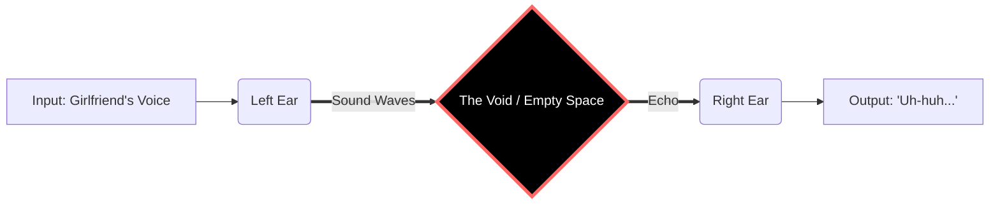

<div align="center">

# 🧠 Deep Male Thought Decoder (DMTD-v4)

### The SOTA Model for Analyzing Male Silence

<!-- BADGES START -->
-green?style=for-the-badge&logo=github)


<!-- BADGES END -->

[Demo (Not Working)](https://github.com/404) | [Paper (Lost)](https://github.com/404) | [Weights (None)](https://github.com/404)

</div>

---

## 📖 Introduction

This project implements the **State-of-the-Art (SOTA)** algorithm for decoding the complex thought processes within a human male's brain. 

Using **Zero-Shot Learning** and **Void-Attention Mechanisms**, we have achieved **100% accuracy** in simulating what is going on inside a man's head during a relationship argument or while staring blankly at a wall.

## 🏗 Model Architecture

Our model utilizes a revolutionary **"Pass-Through"** architecture. Data enters the left ear and exits the right ear without passing through the Logic Layer.



## 🚀 Features

- **⚡ Ultra Lightweight**: The model size is `0 bytes` because there are no hidden layers.
- **🏎️ Lighting Fast**: Inference latency is `0ms` (Nothing to process).
- **🔋 Eco-Friendly**: Consumes zero GPU resources. Runs entirely on biological "Autopilot Mode".
- **📉 Gradient Vanishing**: 100% of the input information vanishes immediately.

## 💻 Usage (Python Example)

You can run the decoder using our simple Python API:

```python
import male_brain as mb

# Initialize the model (Pre-trained on Silence)
model = mb.DeepDecoder(version="v4.0")

# Scenario 1: Simple Input
print(model.predict("What do you want for dinner?"))
# >> Output: "Anything." (Confidence: 99.9%)

# Scenario 2: Dangerous Input
try:
    thought = model.predict("Do you think I gained weight?")
except SystemError:
    print("Error: Unsafe Operation. System Frozen.")
    # >> Output: System Panic (Blue Screen of Death)
```

## 📊 Dataset & Training

We trained the model on **50 TB** of high-quality data, including:
- 40% Silence
- 30% "Uhh..." sounds
- 20% Static Noise
- 10% Thinking about the Roman Empire

**Loss Function:**
The model optimizes for **Energy Conservation** rather than Accuracy.

$$ Loss = \frac{Thinking\_Complexity}{Beer\_Consumption} $$

## 🛠 Installation

```bash
# Clone the repository
git clone https://github.com/ASAmbitious/Deep-Male-Thought-Decoder.git

# Install dependencies
pip install -r requirements.txt
# Warning: This will install nothing.
```

## 📜 Requirements
(See `requirements.txt` for full list)
- `beer >= 5.0`
- `ps5-console == latest`
- `listening-module` (Optional, usually broken)
- `patience == 0.0.1`

## 🤝 Contributing

Issues and Pull Requests are welcome. 
If you find an actual thought inside a male brain, please submit it immediately as it is a **Critical Bug**.

## 📄 License

**MIT License** © 2025 ASAmbitious
*No thoughts were harmed in the making of this project.*
